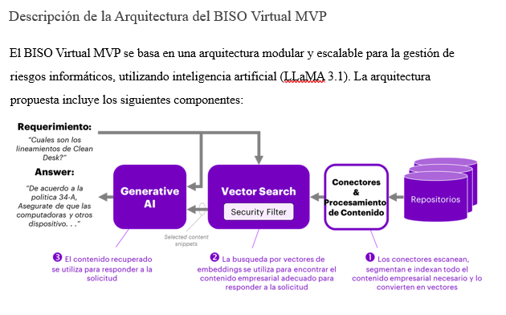

# LedaRojo.github.io

## 👩‍💻 Leda Eugenia Rojo

📧 Email: [leda.rojo@gmail.com](mailto:leda.rojo@gmail.com)  
🔗 LinkedIn: [linkedin.com/in/leda-eugenia-rojo-ai](https://www.linkedin.com/in/leda-eugenia-rojo-ai-1b51992/)  
🌐 GitHub: [github.com/LedaRojo/LedaRojo.github.io](https://github.com/LedaRojo/LedaRojo.github.io)

---
## 🎯 Perfil Profesional
**Especialista en Gestión Estratégica de IA, IA aplicada y Ciencia de Datos**

## 💼 Experiencia Laboral actual
**Gerente de Proyectos de IA** – GMINDS(2021 - Presente)  

## 📚 Educación

- **Posgrado en Gestión Estratégica de IA y Automatización Empresarial**  
  *Universidad del CEMA (Centro de Estudios Macroeconómicos de Argentina)* — 2025

- **Diplomatura en Ciencia de Datos**  
  *UTN (Universidad Tecnológica Nacional)* — 2024

- **Especialista en Inteligencia Artificial e Ingeniería del Conocimiento**  
  *Universidad CAECE – Centro de Altos Estudios en Ciencias Exactas* — (Carrera de Master en IA, 1999)

- **Ingeniera en Computación**  
  *UCSE – Universidad Católica de Santiago del Estero* — (1992)

## 🛠️ Tecnologías/Capacidades

- **Lenguajes:** Python, R, SQL, lenguaje C++
- **Frameworks y librerías:** Pandas, NumPy, scikit-learn, PyTorch, Matplotlib, PennyLane
- **Automatización y RPA:** UiPath, Python scripting
- **Ingeniería de datos:** ingestión, carga y transformación de datos y almacenamientos en data y delta lakes, Bases sql y no-sql: documentales y vectoriales.
- **Análisis exploratorio de datos:** Limpieza, ETL, PCA, T_SNE  
- **Visualización de datos:** Power BI, Matplotlib , Plotly
- **Machine Learning:** Regresión, clasificación, PCA, clustering  
- **Deep Learning:** Redes neuronales convolucionales  
- **IA aplicada:** Diseño y desarrollo de chatbots, agentes de IA, tecnología RAG, incluyendo acceso a modelos de llms y embeddings a través de apis de OpenAI y otras
- **Computación cuántica:** Redes neuronales cuánticas aplicadas a la visión artificial y al mantenimiento predictivo de plantas industriales, entre otros problemas.
- **Gestión de proyectos IA:** Liderazgo técnico, planificación y comunicación con stakeholders  

---
## 📂 Proyectos

Revisá la carpeta [`/Proyectos`](./Proyectos) para explorar desarrollos y notebooks de IA, ciencia de datos y automatización.
## Proyectos IA:
<table>
<tr>
<td width="50%">
<h3 align="center">Asistente Virtual Inteligente para la Gestión de Riesgos Informáticos</h3>

1.	Resumen Ejecutivo
En el marco de nuestra iniciativa de transformación digital, proponemos el desarrollo de un asistente virtual inteligente especializado en seguridad de la información (BISO Virtual), basado en la tecnología LLaMA 3.1. Este asistente estará diseñado para brindar soporte a los equipos de seguridad de la información, facilitando la gestión de políticas, regulaciones y riesgos de ciberseguridad.
El BISO Virtual permitirá:
●	Automatizar tareas clave: Responderá de manera automática a consultas frecuentes, generará reportes de cumplimiento y hará seguimiento continuo de incidentes de seguridad.
●	Mejorar la eficiencia operativa: Proporcionará acceso inmediato y actualizado a normativas, mejores prácticas y tendencias de seguridad, optimizando el tiempo de los equipos.
●	Capacitar al personal: Ofrecerá formación continua y acceso instantáneo a conocimientos especializados para fortalecer las capacidades del equipo de seguridad.
Este proyecto representa una oportunidad única para posicionar a los bancos que lo implementan como líderes en innovación en el sector financiero, mejorando la seguridad de la información y optimizando los procesos internos.

                                                                                      
</td>

---

## 🧠 Intereses paralelos.
- Artista plástica: cuadros abstractos sobre lienzo y artesanales sobre madera. Creaciones propias.

  
---

🧠 *“La inteligencia artificial no reemplazará a los humanos, sino que potenciará su capacidad de transformación.”*
